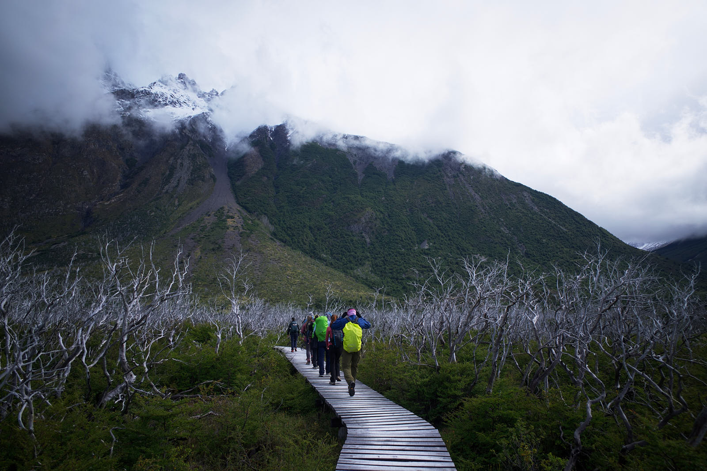

Photography is my passion. I love it in all its forms, from sports to fine art,
portraiture to landscape, studio to street. Human nature is to categorize and
thus we end up thinking of these as distinct genres within the field, but each
category has more in common with the others than difference separating them.
Nonetheless, I think there are some ideals embraced by one field which can
bring new creative freedom when practiced in another. Specifically, I believe
that nature photographers can benefit from thinking more like a street
photographer.

The term "decisive moment" was brought into the photography lexicon by Henri
Cartier-Bresson and the publication of his 1952 book *Images à la Sauvette*,
released in English as *The Decisive Moment*. Cartier-Bresson is widely regarded
as the father of the street photography genre and *The Decisive Moment* as
its bible. One philosophy espoused therein is that we photographers must be able
to see a composition that life has presented to us and in the fraction of a
second capture it with the click of our shutter. If we miss that chance, then
it is gone forever. That instant in which the right composition can be captured
and frozen in time is the decisive moment.

Many nature photographers likely look to a contemporary of Cartier-Bresson as
the archetype of their genre: Ansel Adams. His approach would aptly be
described as slower and more contemplative than Henri Cartier-Bresson's, but the
focus on composition is why each of these titans are held in such high regard.
In the pursuit of capturing nature's glory Adams carried large format cameras
deep into the wilderness. If you've never used a large format view camera, I can
assure you there is nothing quick about them. But as I said at the start, there
is more in common between the types of photography than there are differences.
The backstory for many of Adams' most iconic photos tell a tale of driving along
and suddenly seeing a composition, slamming on the brakes and getting out to
make the shot. Perhaps the key difference was the speed at which the
compositions were changing for each of these photographers.

The timescales at hand for a nature photographer can vary from the
leisurely pace of the moon rising all the way to the frenetic action of an eagle
suddenly diving for a fish. Some of us set out prepared for the slower pace of
landscape photos with tripods and remote triggers. Others might be planning for
the erratic nature of wildlife photography with long lenses, fast shutters
and locations mapped where we hope to see elusive creatures. But is there
another opportunity somewhere between these extremes? Can we approach the trail
itself as our subject, much the way that street photographers find inspiration
in the everyday happenings of our urban environments? Perhaps our companions on
the journey are subjects worthy of our attention, as are all the minor details
along the way.

None of this is really new, of course. If you've spent any time reading the
pages of National Geographic, then you will have seen countless stories of
adventure, captured by photojournalists looking for those decisive moments in
wildernesses around the world. Why, then, are so many amateur photographers
striving to emulate Ansel Adams rather than Jimmy Chin or Michael Nichols? I
think at least part of the reason is that it's really difficult, mentally and
physically, to engage as a documentarian while also navigating the wilds.
This leads me to wonder, how can we eliminate some of the challenges that
present themselves on the trail and prevent us from sharing the journey with
our audience?

When I go backpacking one of my problems has always been the tradeoff between
storing my camera in the pack or having it slung around my neck on a camera
strap. Stashing your gear in the backpack allows for the most comfort as well as
keeping your delicate equipment safe, but it means that you'll rarely capture the
spontaneous events we are looking for. On the other hand, the camera strap
offers immediate access, opening up more opportunities to capture those fleeting
moments, but the tradeoffs are not insignificant. On long treks a camera strap
grows uncomfortable quickly. The camera itself swings about and always feels at
risk of damage if you find yourself scrambling over logs or rocks. Camera straps
also narrow down the equipment that is reasonable. I often prefer to shoot with
a 70-200mm lens, an insane proposition on a camera strap even in the most
comfortable environment.

What to do? For years I simply fought with my camera on a strap around my neck.
Rather than shoot with my preferred 70-200mm I would use an 85mm prime. In 2023
I was planning a trip to Torres del Paine in southern Chile and was convinced
there must be a better solution. As a sports photographer I'm used to carrying
a lot of gear and I've used all sorts of systems that work great on the
sidelines but never helped me out on the trail. My search eventually led me to
the Peak Design [Capture Clip](https://www.peakdesign.com/products/capture), a
system that promised to give the best of both worlds.

The capture clip solves the problem of where to store your camera while hiking
by turning your backpack's shoulder strap into a place to mount your gear. It
keeps the weight close to your body and off your neck. It's very sturdy and I
have no hesitation using my 70-200mm f/2.8 with the system. I ordered a second
plate that I always keep screwed in on the tripod mount for the 70-200 so that
I can have another one on my camera body for when I'm using a 24mm or other
small lens.

Drawing the camera simply involves holding down a button and sliding the plate
out of the clip. If you have a small lens on, this can be done single-handed,
but with a 70-200 this is a two-hand job. Similarly, mounting the camera in the
clip just requires sliding the plate back into place. It's a quick and reliable.

My trek through Torres del Paine put the system to the test and I came out a
complete convert. There was rarely a moment when I wasn't prepared to document
the details of the journey. This was the most comfortable that I've ever
been carrying a camera while trekking. As a result, I also think that I was able
to create images that were more meaningful for me and for my comrades.

Can something as seemingly minor as a camera carrying system change the way you
photograph the world? Maybe. I know that for me it has allowed me to be far more
engaged photographically while trekking. Over the past two years I have changed
the way that I approach my travel photography. I'm sure that this isn't solely
due to equipment, but I do think the gear has enabled me to strive for more
decisive moments in my work.

Quixotically, I've arrived at this new phase in my photography just as our world
seems to be turning away from in-depth coverage. In a landscape ruled by video
shorts and 280 character tweets where do we tell the stories that mean the
most to us?

{}
