Why do we do it? Why do we lug bulky, expensive camera gear with us to the
ends of the earth? I can only speak for myself, but I can't imagine traveling to
faraway lands and *not* bringing a camera. Somewhere deep inside of me there is
a burning need to document these experiences and then share them. But that still
doesn't explain all the hassle. After all, isn't every phone also a camera these
days? Yes, but... It can be hard to describe to someone why you feel the need to
have a dedicated camera and an array of lenses. Maybe even a tripod that you
find yourself carrying through airports and strapping to the outside of your
backpack.

The answer, I think, is that this gives us agency. It allows us more control
over the images that we craft. We gladly burden ourselves with extra weight and
bulk because it broadens the scope of what what we can create. And the planning
can feel like half the fun. We envision what will be encountered on a trip and
pack the best gear for that destination. But is that enough?

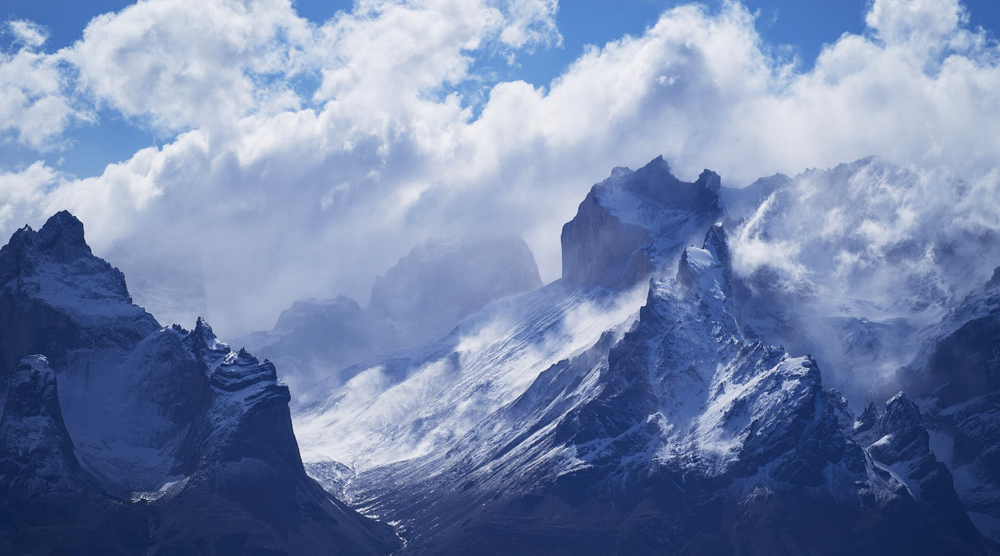
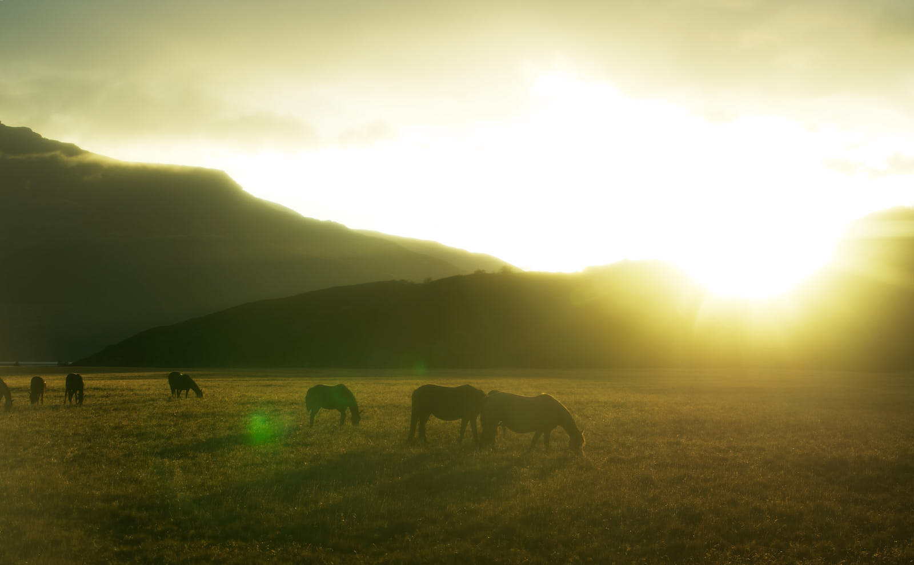

### Destination Stagnation

If you've never visited the Grand Canyon, you really owe it to yourself to do
so. The name is no exaggeration. The first time you stand at the edge your mind
struggles to comprehend what your eyes are telling you. The chasm before you
could swallow up whole cities. The turquoise ribbon of the Colorado River snakes
its way around the bends at the bottom, thousands of feet below. Ant-like
columns of hikers wend their way along the trails below, granting perspective to
those along the rim.

When you visit, your first view of this wonder of nature will probably be from
the visitor center along the south rim of the canyon. The experience is so
overwhelming that you will almost certainly take a series of photos from this
overlook. Maybe you start with a cell-phone selfie. Maybe you instead focus on
taking panoramic shots of the grand vista. Perhaps you zoom in on the river a
mile below. Amazingly, you already know what all of these views should look
like. You've seen an endless series of photos from this exact point. And yet it
still impacts you deeply to take it in personally. Later, when you look back at
your images from this precipice, the greatest impact likely will not be due to
the way you captured nature's majesty, but rather it will be a remembrance of
who was with you as the grandeur swept over you. You'll probably also chuckle,
or perhaps grumble, thinking back to the endless busloads of tourists streaming
to the very same lookout point to take their obligatory photos and then return
to the air conditioned comfort of the tour bus.

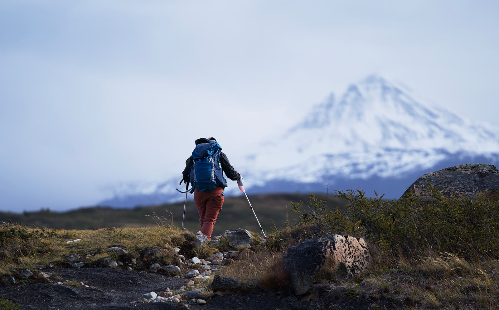
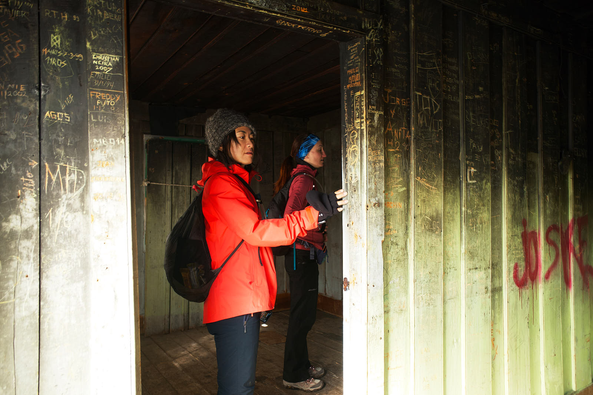

What, if anything, differentiates the photos of those in the tour bus herd from
your own? Perhaps you used different equipment. Maybe you zoomed in with a
longer lens on some particular feature. You perhaps timed your arrival for
better light. But let's assume that the visitor center or some other scenic overlook
is not your final destination. Rather, you intend to hike down to the river and
back, experiencing the range of what this place has on offer. From deep in the
canyon you work to craft images which evoke a sense of geologic time for your
audience. These offer much more meaning for you and allow your creativity to
surface in ways that were not possible from the lookout points above.

This, surely, is why we go to the trouble of carrying cameras and lenses,
tripods and filters to places where everyone else has winnowed their packs down
to a minimum. And yet, these meaningful photos put forth an almost sterile view
of an experience that was quite the opposite. A shot of the azure sky
perfectly framed by red cliffs will never convey the reality of what it took to
capture. The clouds of dust that caked your mouth, kicked up by an endless
stream of other hikers. Aching muscles and sun-brittle skin, irritated at how
your backpack rubs. The constant vigilance needed to avoid stepping in
*yet another* puddle of mule piss. It is these gritty details that you tell
stories about when you're showing someone your stunning photos of the Grand
Canyon's depths. When you meet up with your comrades from the trip, these are
the subject about which you reminisce.

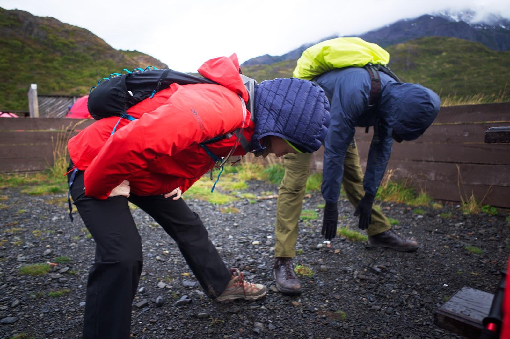
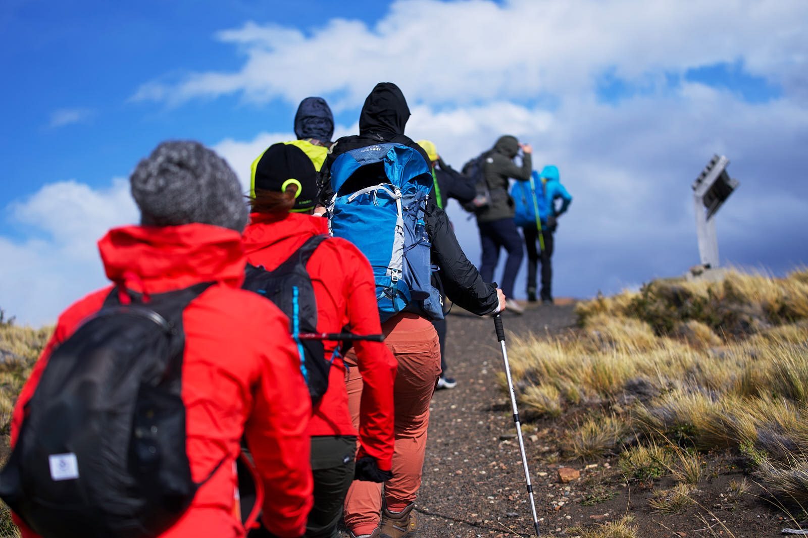

### Looking for the Journey

Somewhere between the sea of selfies offering proof of visitation and a
desert of pristine landscapes crafted to present a world untouched
by humans, there lies a space where we can present an honest account of our
adventures. A space where our friends and family are not posed for effect but
are instead the main characters in a true tale of their own making. When we,
as photographers, are able to inhabit this middle ground we can start to
visually communicate the stories that we only previously recounted as
accompaniment to our photos.

How do we begin to document meaningful moments throughout the journey?
I think the first step is to be ready to capture
[decisive moments](posts/decisive-moment-trail/) as they play out. If your
camera is buried away in your backpack, it's unlikely that you'll use it outside
of those times when you decide to stop and photograph some grand vista. Instead,
you should be ready to take a photo at any moment, whether it's with your main
camera or with a cell phone. Keep your eyes peeled for times of struggle,
accomplishment and emotion. Look for the little details that help to tell a
nuanced story. Err on the side of being too prolific with your shooting, culling
your images once you're home rather than not shooting them to begin with.
Embrace spontaneity and you'll be rewarded visually.

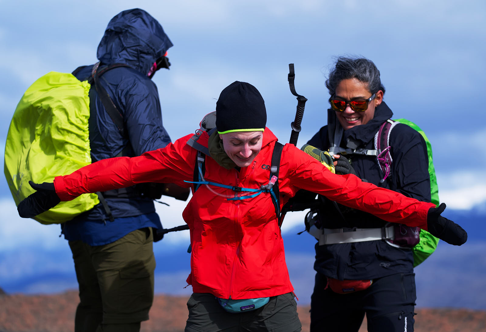
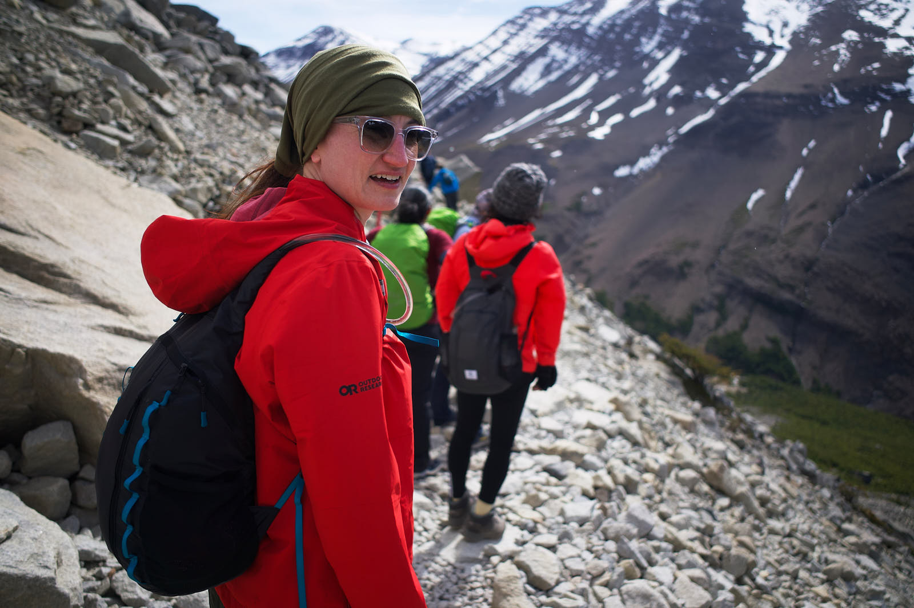

Crafting a coherent story takes more than just a collection of impactful shots,
though. Preparation will allow you to tell a tale that flows and
represents the different experiences of your companions and yourself. Plan your
visual storytelling with different angles and focal lengths. Set aside quieter
moments to capture environmental portraits of those traveling with you. In the
field review the images that you've already created and assess whether or
not you need to adjust your approach. Your preparation and planning will free
your mind up for creativity when the right moments arrive.

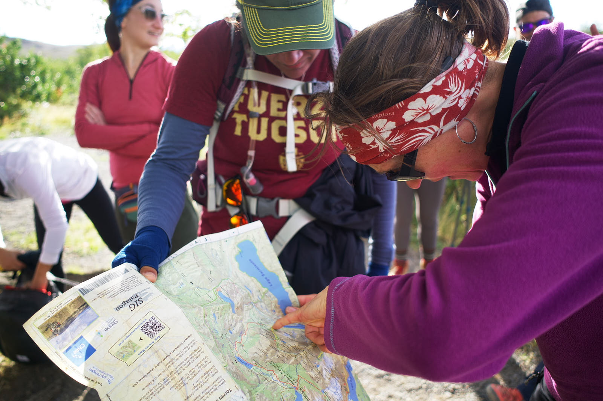
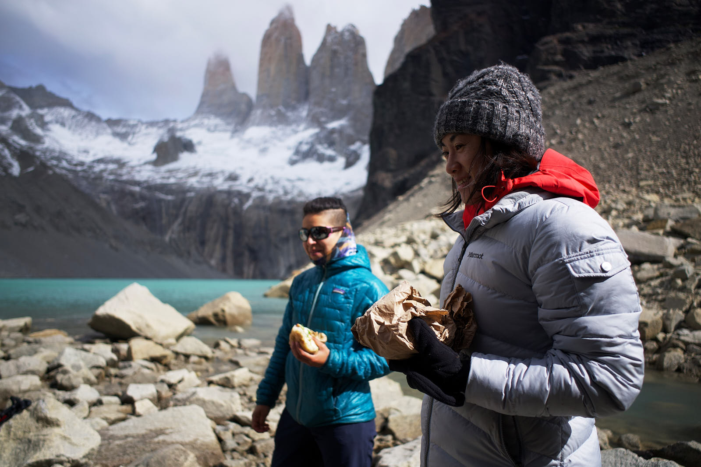

### Sharing the Journey

Does this help us to answer the question of why we do it? Perhaps we can now
answer with a bit more nuance. We're bringing all this gear to the ends of
the earth so that we can tell the tale of an adventure. We burden ourselves with
cameras and lenses because the language we choose to use is visual and these are
the tools that we need to write the story. And that story isn't just ours, but
is the story of a community.

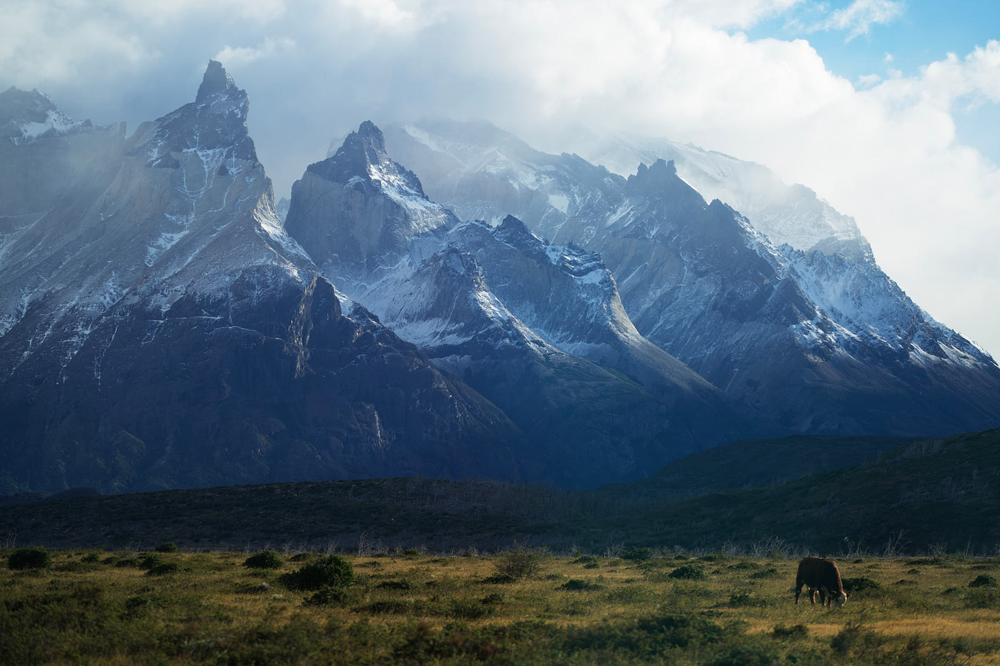
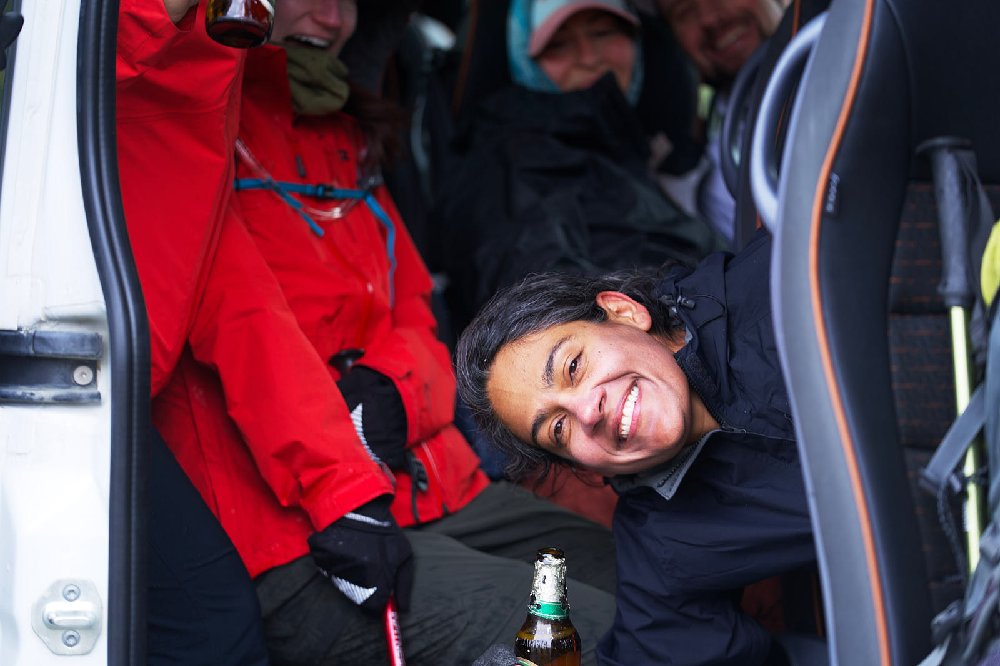

{}
